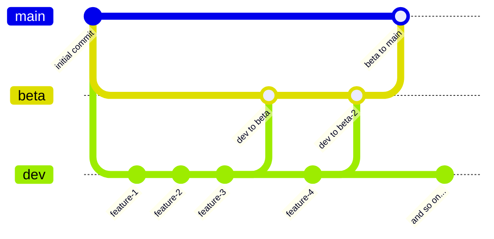

# RedFox Studios - Website

This repository is for our website.

> [!TIP]
> **Branch Structure**
> - **Main** - Production release branch
> - **Beta** - Testing branch (merges to main when stable)  
> - **Dev** - Development branch (submit all PRs here please)

