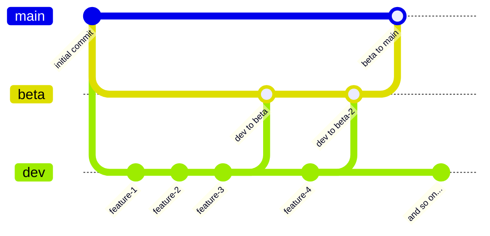

# RedFox Studios - Website

This repository is for our website.

> [!IMPORTANT]
> Planning to contribute? [Fork the repository](https://github.com/redfox-studios/redfox-studios/fork), 	<ins>**uncheck**</ins> "Copy main branch only", then:
> 1. In your fork’s settings, set the default branch to `Dev`.
> 2. Make your changes on the `Dev` branch.
> 3. Open a pull request when ready.

> [!TIP]
> **Branch Structure**
>
> - **Main** - Production release branch
> - **Beta** - Testing branch (merges to main when stable)
> - **Dev** - Development branch (submit all PRs here please)

